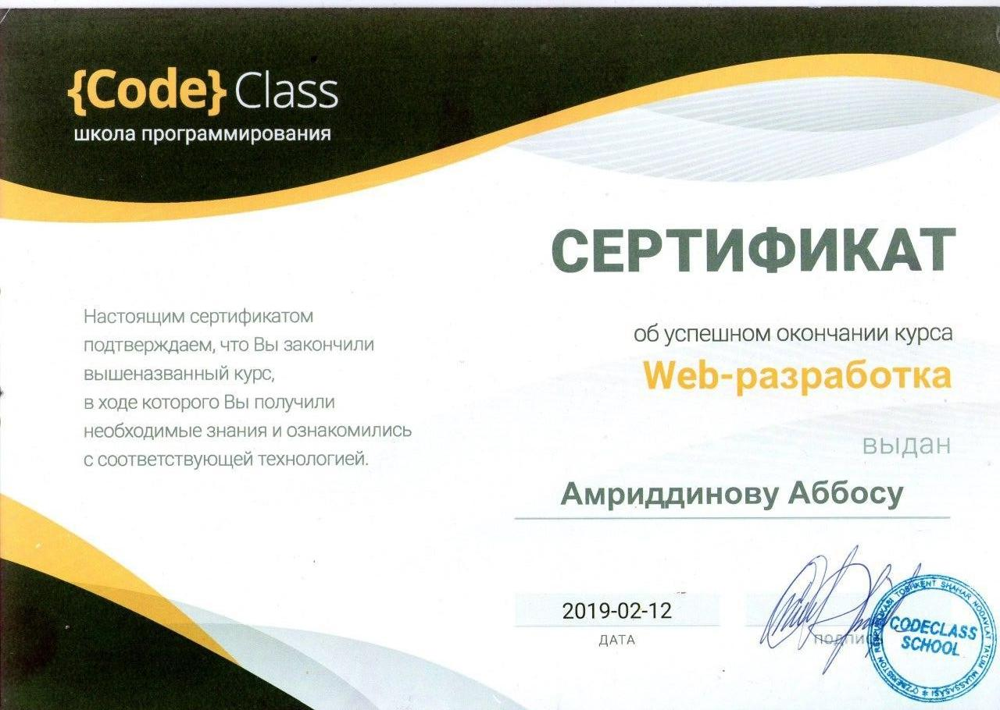

# Abbos Amritdinov

### Contact Info:
  * E-mail: abbos6264258@gmail.com
  * Phone: +998 94 6264258
  * Telegram: [@ron2_webdev](http://t.me/rON2_webdev)

### Summary:
  Passionate about programming, hope to work on interactive apps and web-program implementation. Ambitious and a quick learner.

### Coding Skills:
  * HTML
  * CSS
  * SASS
  * Bootstrap
  * JavaScript
  * VSCode
  * GIT
  * WebPack
  * ESLint

### Code example: 
```javascript
import data from './data/cards'; // Данные
import menu from './menu' // Боковое меню
import cards from './cards'

function mainPage() { // Отрисовка главной страницы с категориями
  const container = document.querySelector('.container.main-container');
  data[0].forEach((element, index) => {
    const a = document.createElement('a');
    a.className = 'main-card green';
    a.onclick = () => { localStorage.setItem('page', index); };
    a.innerHTML = `${element}`;
    a.href = './cards.html';
    container.append(a);
    const img = document.createElement('img');
    img.src = `./data/${data[index + 1][0].image}`;
    a.prepend(img);
  });
}
```

### Experience:
 Completed a 6-month-long web-devepment course at CodeClass Coding School in Tashkent. Have completed online courses at HTMLacademy and created a wordpress site as a freelance project.
 At this moment attending [Rolling Scopes School](http://rs.school)
 

### Education:
- [CodeClass school of Programming](https://codeclass.uz)
 
- [Rolling Scopes School](https://rs.school)
- [HTML Academy](https://htmlacademy.ru)
- 42-public school 

### English:
 Intermidiate level - [Wise Training Centre](http://wisetraining.uz)
 
### Projects:
* [Weather App](https://abbos-ron2.github.io/weather)
* [Virtual Keyboard](http://abbos-ron2.github.io/virtual-keyboard)
* [Gem Puzzle](https://modest-aryabhata-b20112.netlify.com)
* [Singolo](https://abbos-ron2.github.io/singolo)
* [Canvas](https://abbos-ron2.github.io/codejam-image-api)
* [English for Kids](https://abbos-ron2.github.io/english/index.html)  (In progress)


### Reference:
- Munira Begmuratova 
- Mentor at Rolling Scopes School
- [Telegram](https://t.me/@Muneeesh)


